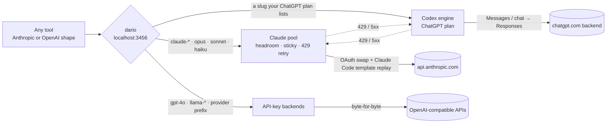
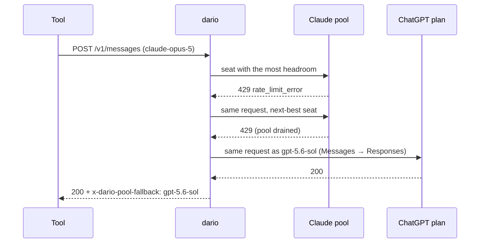
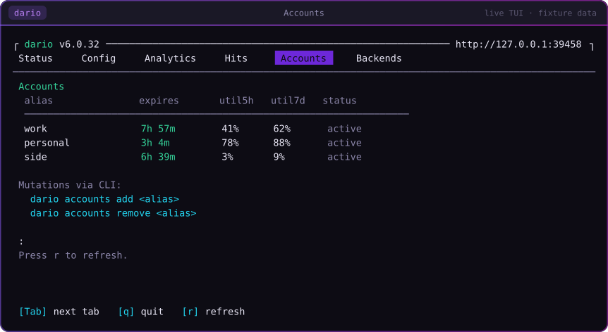
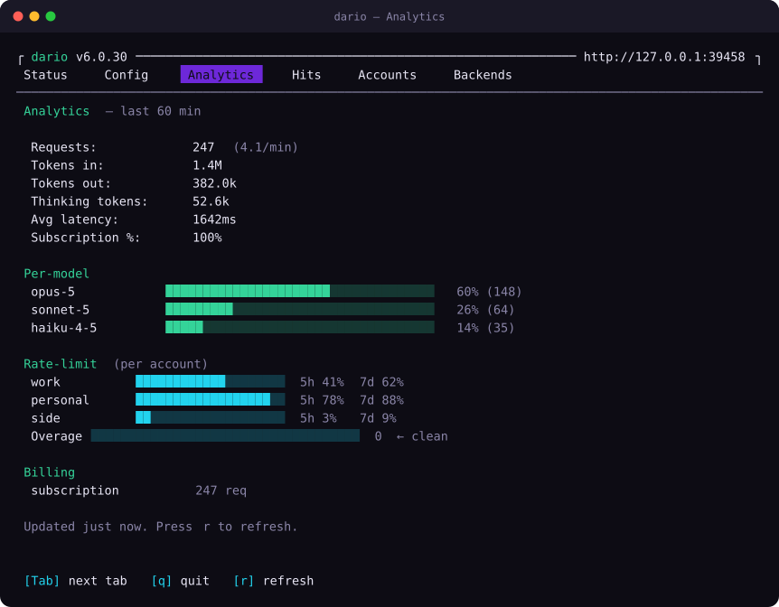

<div align="center">

<picture>
  <source media="(prefers-color-scheme: dark)" srcset=".github/readme/hero-dark.svg">
  
</picture>

# `dario`

### Your Claude and ChatGPT subscriptions each work in exactly one place.<br/>dario makes them work **everywhere** — at subscription pricing, not per-token API bills.

<p>
  <a href="https://www.npmjs.com/package/@askalf/dario"></a>
  <a href="https://github.com/askalf/dario/releases"></a>
  <a href="https://github.com/askalf/dario/actions/workflows/ci.yml"></a>
  <a href="https://github.com/askalf/dario/actions/workflows/codeql.yml"></a>
  <a href="https://scorecard.dev/viewer/?uri=github.com/askalf/dario"></a>
  <a href="https://www.bestpractices.dev/projects/13638"></a>
  <a href="https://github.com/askalf/dario/blob/master/LICENSE"></a>
  <a href="https://www.npmjs.com/package/@askalf/dario"></a>
  <a href="https://www.npmjs.com/package/@askalf/dario"></a>
</p>

<p>
  <a href="https://github.com/askalf/dario/blob/master/src/cc-template-data.json"></a>
  <a href="https://github.com/askalf/dario/actions/workflows/cc-billing-classifier-canary.yml"></a>
  <a href="https://github.com/askalf/dario/actions/workflows/cc-drift-watch.yml"></a>
  <a href="https://github.com/askalf/dario/actions/workflows/cc-drift-template-watch.yml"></a>
</p>

<p><strong>One local endpoint. Every AI tool you own. The subscriptions you already pay for.</strong></p>

<sub><code>npm i -g @askalf/dario</code> · <strong>0</strong> runtime deps · <a href="https://www.npmjs.com/package/@askalf/dario">SLSA-attested</a> every release · nothing phones home · ~31k lines you can read in a weekend · independent, unofficial, third-party (<a href="DISCLAIMER.md">DISCLAIMER.md</a>)</sub>

<sub><a href="#start-in-60-seconds">Start</a> · <a href="#point-your-tools-at-it">Your tools</a> · <a href="#what-it-does-with-a-request">Routing</a> · <a href="#two-plans-one-endpoint">Two plans</a> · <a href="#many-seats-one-endpoint">Pool</a> · <a href="#it-tracks-a-moving-target">Drift</a> · <a href="#trust--transparency">Trust</a> · <a href="#will-my-account-get-suspended">Risk</a> · <a href="#commands">Commands</a> · <a href="#faq">FAQ</a> · <a href="docs/returning.md">Coming back after a while?</a></sub>

</div>

---

You're already paying $20, $100 or $200 a month for Claude,[^plans] or for a ChatGPT plan. Then Cursor wants an API key. Aider wants an API key. Cline, Continue, Zed, your own scripts — every one of them bills you **again**, per token, while the plan you bought sits idle in the one app it shipped with.

**dario is one local endpoint that routes all of them through the plans you already pay for.** Point any Anthropic- or OpenAI-compatible tool at `http://localhost:3456` and you're done. No per-tool config, no second bill, and when one plan hits its limit the other one takes the request.

## Start in 60 seconds

```bash
# 1. Install
npm install -g @askalf/dario

# 2. Log in to your Claude subscription (Pro, Max 5x, or Max 20x)
dario login                 # or `dario login --manual` for SSH / headless

# 3. Start the local proxy
dario proxy                 # separate terminal or background

# 4. Point any Anthropic-compatible tool at it
export ANTHROPIC_BASE_URL=http://localhost:3456
export ANTHROPIC_API_KEY=dario
```

<picture>
  <source media="(prefers-color-scheme: dark)" srcset=".github/readme/quickstart-dark.svg">
  
</picture>

That's the whole setup. Every tool that honors those env vars now runs on your subscription. OpenAI-shaped tools use `OPENAI_BASE_URL=http://localhost:3456/v1` instead, same key.

**Works with:** Claude Code, Cursor, Aider, Cline, Roo Code, Kilo Code, Continue.dev, Zed, OpenHands, OpenClaw, Hermes, Codex CLI, the [Claude Agent SDK](https://www.npmjs.com/package/@anthropic-ai/claude-agent-sdk), the Anthropic and OpenAI SDKs, curl, your own scripts. Per-tool snippets are one section down; the honest per-tool status is in the [compatibility matrix](./docs/integrations/compat-matrix.md).

Prefer Docker? `ghcr.io/askalf/dario:latest` — multi-arch (`amd64` + `arm64`), published from the same workflow as every npm release ([guide](./docs/docker.md)). Something off? `dario doctor` prints one paste-ready health report.

## Point your tools at it

Two base URLs, one key. Anthropic-shaped clients talk to `http://localhost:3456`; OpenAI-shaped clients talk to `http://localhost:3456/v1`. The key is `dario` (any value works until you set `DARIO_API_KEY`, which then has to match).

<details>
<summary><strong>Claude Code</strong> — forwarded verbatim</summary>

```bash
export ANTHROPIC_BASE_URL=http://localhost:3456
export ANTHROPIC_API_KEY=dario
claude
```

A genuine Claude Code request already *is* the Claude Code shape, so dario forwards it byte-for-byte — system prompt, tools, thinking, key order untouched — swapping in only the pool's credential, its billing tag and cache breakpoints. That covers the main loop, its Task/Agent sub-agents and the permission classifier. What you gain is the pool: several seats behind the one URL, with headroom routing and 429 failover. Background: [#678](https://github.com/askalf/dario/issues/678).
</details>

<details>
<summary><strong>Cursor</strong> — needs a public HTTPS tunnel, and the <code>anthropic:</code> prefix</summary>

Cursor's BYOK is backend-mediated: the app sends your base URL up to Cursor's servers and *they* make the call, behind an SSRF guard that rejects `localhost` by design (confirmed by Cursor staff, threads linked in the long-form guide). So:

```bash
dario proxy                                     # terminal 1
cloudflared tunnel --url http://localhost:3456   # terminal 2 → https://<random>.trycloudflare.com
```

In Cursor → Settings → Models: enable **Override OpenAI Base URL** with `https://<random>.trycloudflare.com/v1`, key `dario`, and add models as `anthropic:opus` / `anthropic:sonnet` / `anthropic:haiku`. The `anthropic:` prefix routes to the Claude backend without the `claude-` substring that makes Cursor switch to a tool format the OpenAI path can't parse, and it dodges Cursor's built-in-name collision. Use **Agent** mode (<kbd>Cmd</kbd>/<kbd>Ctrl</kbd>+<kbd>I</kbd>); Chat sends no tools. Treat the tunnel URL as a credential. Full walkthrough with every gotcha: [agent-compat.md#cursor](./docs/integrations/agent-compat.md#cursor).
</details>

<details>
<summary><strong>Cline · Roo Code · Kilo Code</strong> — API provider "Anthropic"</summary>

Provider **Anthropic** · API key `dario` · Anthropic Base URL `http://localhost:3456` · model `claude-sonnet-5` / `claude-opus-5` / `claude-haiku-4-5`.

These clients speak an XML tool protocol. dario detects them from their system-prompt identity markers and flips into preserve-tools mode on its own, so their schemas pass through and their parsers keep working. `--no-auto-detect` if you'd rather choose. [Details](./docs/integrations/agent-compat.md#cline--roo-code--kilo-code).
</details>

<details>
<summary><strong>Aider</strong></summary>

```bash
export ANTHROPIC_BASE_URL=http://localhost:3456
export ANTHROPIC_API_KEY=dario
aider --model sonnet        # or opus, haiku, any claude-* id
```
</details>

<details>
<summary><strong>Continue.dev</strong></summary>

```yaml
# ~/.continue/config.yaml
models:
  - name: Claude Sonnet (dario)
    provider: anthropic
    model: claude-sonnet-5
    apiBase: http://localhost:3456
    apiKey: dario
```
</details>

<details>
<summary><strong>Zed</strong></summary>

```json
{ "language_models": { "anthropic": { "api_url": "http://localhost:3456", "version": "2023-06-01" } } }
```

Set `ANTHROPIC_API_KEY=dario` in the environment Zed launches from; the model picker then lists Claude models routed through your plan.
</details>

<details>
<summary><strong>OpenHands</strong></summary>

```bash
export LLM_BASE_URL=http://localhost:3456
export LLM_API_KEY=dario
export LLM_MODEL=anthropic/claude-sonnet-5
```

The `anthropic/` prefix tells LiteLLM (OpenHands' router) to take the Anthropic path, which dario is now fronting. End-to-end walkthrough: [openhands-walkthrough.md](./docs/integrations/openhands-walkthrough.md).
</details>

<details>
<summary><strong>OpenClaw</strong></summary>

```bash
export ANTHROPIC_BASE_URL=http://localhost:3456
export ANTHROPIC_API_KEY=dario
openclaw "task description"
```

OpenClaw's `exec` / `process` / `web_search` / `web_fetch` / `browser` / `message` tools are translated to Claude Code's set without a flag. Newer OpenClaw reads `auth-profiles.json` before env vars, so a stale key there wins — the [walkthrough](./docs/integrations/openclaw-walkthrough.md) covers it.
</details>

<details>
<summary><strong>Codex CLI · OpenAI SDK · any OpenAI-compatible tool</strong></summary>

```bash
export OPENAI_BASE_URL=http://localhost:3456/v1
export OPENAI_API_KEY=dario
```

Ask for `gpt-5.5` and it is served by your ChatGPT plan once you've run `dario add altman`. Ask for `claude-sonnet-5` on the same URL and it is served by your Claude plan, translated both ways. Ask for `gpt-4o`, `llama-3.3-70b` or anything an API-key backend lists and it goes there byte-for-byte:

```bash
dario backend add openai     --key=sk-proj-...
dario backend add groq       --key=gsk_...    --base-url=https://api.groq.com/openai/v1
dario backend add openrouter --key=sk-or-...  --base-url=https://openrouter.ai/api/v1
dario backend add local      --key=anything   --base-url=http://127.0.0.1:11434/v1
```

Force a backend with a prefix: `openai:gpt-4o`, `claude:opus`, `groq:llama-3.3-70b`, `local:qwen-coder`.
</details>

<details>
<summary><strong>Claude Agent SDK · Anthropic SDK</strong> (TypeScript, Python)</summary>

```ts
import Anthropic from "@anthropic-ai/sdk";
const client = new Anthropic({ baseURL: "http://localhost:3456", apiKey: "dario" });
```

```python
import anthropic
client = anthropic.Anthropic(base_url="http://localhost:3456", api_key="dario")
```

Zero code change beyond the base URL. Streaming, tool use, prompt caching and extended thinking all pass through. More in [usage.md](./docs/usage.md).
</details>

<details>
<summary><strong>curl</strong></summary>

```bash
curl http://localhost:3456/v1/messages -H "content-type: application/json" \
  -d '{"model":"claude-sonnet-5","max_tokens":256,"messages":[{"role":"user","content":"Hello!"}]}'

curl http://localhost:3456/v1/chat/completions -H "content-type: application/json" \
  -d '{"model":"gpt-5.5","messages":[{"role":"user","content":"Hello!"}]}'
```
</details>

<details>
<summary><strong>Docker</strong> · Kubernetes · a Pi in a closet</summary>

```bash
docker volume create dario-config
docker run --rm -it -v dario-config:/home/dario/.dario ghcr.io/askalf/dario:latest login --manual
docker run -d --name dario -p 3456:3456 -v dario-config:/home/dario/.dario \
  -e DARIO_API_KEY="$(openssl rand -hex 32)" ghcr.io/askalf/dario:latest
```

The image binds `0.0.0.0`, so a key is mandatory; without one dario refuses to start rather than become an open relay for your subscription. No console at all? Start empty with `DARIO_ADMIN=1` and provision the first account over HTTP with the [admin API](./docs/admin-api.md). Two replicas sharing accounts need the [refresh lock](./docs/multi-instance.md). [Docker guide](./docs/docker.md).
</details>

Something not listed? If it reads `ANTHROPIC_BASE_URL` or `OPENAI_BASE_URL`, or has a "Base URL" field, it works. The [compatibility matrix](./docs/integrations/compat-matrix.md) says which tools are exercised end-to-end, which are inferred from a shared code path, and which are untested — one honest cell per tool.

## What it does with a request

You point every tool at one URL. dario reads each request, decides which plan or backend owns it, and forwards it in that backend's native protocol.



| Client speaks | Model | Routes to | What happens |
|---|---|---|---|
| Anthropic Messages | `claude-*` / `opus` / `sonnet` / `haiku` | Claude pool | OAuth swap + Claude Code template, then `api.anthropic.com` |
| Anthropic Messages | a slug your ChatGPT account lists | Codex engine | Messages→Responses translation, subscription auth |
| Anthropic Messages | `gpt-*`, `llama-*`, … | OpenAI-compat backend | Anthropic→OpenAI translation, forwarded |
| OpenAI Chat | `gpt-*` / `o1-*` / `o3-*` | OpenAI-compat backend | Auth swap, body forwarded byte-for-byte |
| OpenAI Chat | a slug your ChatGPT account lists | Codex engine | chat/completions→Responses translation, subscription auth |
| OpenAI Chat | `claude-*` | Claude pool | OpenAI→Anthropic translation, then the Claude path |
| Either | `<provider>:<model>` | Forced by prefix | Explicit override |

The tool doesn't know. The backend doesn't know. dario is the seam.

**The full Claude lineup, autodetected.** Fable 5, Opus 5, Sonnet 5 and Haiku 4.5, plus `[1m]` long-context variants on every family except Haiku, by full id (`claude-opus-5`) or shortcut (`fable` / `opus` / `sonnet` / `haiku`; append `1m` for the long-context form; `opus48` / `opus47` / `opus46` / `sonnet46` pin a generation and never float). `GET /v1/models` reads Anthropic's live catalog (TTL-cached, baked fallback offline), so a new model resolves the day it lands with no dario release, and the model-specific request shape is applied automatically. Families pulled upstream are filtered from both the live catalog and the fallback, so `/v1/models` never advertises a model that 404s.

## Two plans, one endpoint

### Your ChatGPT plan, on both endpoints

A ChatGPT Plus or Pro plan is served on **both** of dario's endpoints: any client that speaks `/v1/chat/completions` can use it (Codex CLI, the OpenAI SDKs, your scripts), and so can any client that speaks `/v1/messages` (Claude Code, the Anthropic SDKs, agent runtimes). The harness never needs to know which subscription is behind it.

```bash
dario add altman            # prints an authorize URL; paste the redirect URL back
dario codex list
dario codex remove altman
```

`dario add altman` names whose plan you are attaching; `dario add amodei` attaches a Claude account instead. The browser lands on a `localhost` page that doesn't load — expected, nothing is listening there. Copy the whole address bar and paste it at the prompt; dario reads the code out of it.

```bash
curl localhost:3456/v1/models | jq -r '.data[].id'
curl localhost:3456/v1/chat/completions -H 'content-type: application/json' \
  -d '{"model":"gpt-5.5","messages":[{"role":"user","content":"hi"}]}'

# same subscription, Anthropic wire shape — this is what Claude Code speaks
curl localhost:3456/v1/messages -H 'content-type: application/json' \
  -d '{"model":"gpt-5.5","max_tokens":64,"messages":[{"role":"user","content":"hi"}]}'
```

**Model names are discovered, not hardcoded.** The set a ChatGPT subscription may use is per-account and moves; dario asks the backend which models this account lists, caches the answer, and advertises them on `GET /v1/models`. Anything not on that list (`gpt-4o` and friends) still routes to a configured API-key backend as before. `codex:<model>` / `chatgpt:<model>` forces the route.

Streaming, tool calls and tool-result round trips work on both shapes: dario translates chat/completions **or** Messages into the Responses API the subscription backend speaks, and translates the stream back into `chat.completion.chunk` or Anthropic message events. There is no `/v1/responses` inbound yet. The Codex backend does not accept every chat field, so `response_format`, `stop`, `n`, `logprobs`, `stream_options` and the sampling parameters `temperature`, `top_p`, `max_tokens`, `max_completion_tokens` are intentionally lossy; with `--verbose`, dario reports each field that does not reach Codex once per process. Codex accounts live in `~/.dario/codex-accounts/`, separate from the Claude pool.

**Prompt caching:** the backend caches prompt prefixes of 1,024 tokens and up on its own; what dario adds is the `prompt_cache_key` that routes same-prefix requests to the cache that holds them, the way the Codex CLI does with its session id. A chat/completions client that sets its own key keeps it; an Anthropic-shape request gets one per Claude Code session (a hash of `metadata.user_id`, never the raw ids); anything else is keyed on its model, instructions and tool names, so repeated system prompts from any caller land together. Cached tokens come back as `prompt_tokens_details.cached_tokens` on chat/completions and as `cache_read_input_tokens` on `/v1/messages`, and show up in `/analytics` and the `-v` usage line like a Claude request's do.

### Failover between subscriptions

Two consumer plans, no API keys, and neither one able to take you down on its own.

```bash
dario proxy --pool-fallback=gpt-5.6-sol,claude-sonnet-5
```

That is a **chain**, read left to right; each provider takes the first entry it can actually serve. When the Claude pool is drained or cooling, the request is served as `gpt-5.6-sol` from your ChatGPT subscription. When the subscription is rate-limited or down, the request is handed back to the Claude pool as `claude-sonnet-5`. Every substituted response carries `x-dario-pool-fallback: <model>` — a silently swapped model family is exactly the surprise this project exists to avoid.



A single-entry chain is one-way and means what it always meant, so an existing config is unaffected. Failover is opt-in: without `--pool-fallback`, a drained pool still returns its honest 429/503. Only a **429 or 5xx** fails over; a 400 surfaces, because a bad request that fails over just reproduces itself on the other provider and buries the real cause. The Claude entry has to be a model the pool can actually serve, checked positively against the live catalog, so a typo can't trade a recoverable 429 for an unrecoverable 404.

`dario doctor` tells you which of these you are actually in:

```
[ OK ]  Failover   symmetric: gpt-5.6-sol → claude-sonnet-5, across 1 Codex account
[WARN]  Failover   armed (gpt-5.6-sol) but INERT — no Codex account and no backend
                   to fall back to. Add one: `dario add altman`
```

That warning is the whole reason the check exists. Armed with nothing to fall back to is green on every other check and incapable of doing anything.

> [!NOTE]
> Upgrading from v5? Nothing to do. Every v6 feature is opt-in and a single-value `--pool-fallback` behaves exactly as it did. [CHANGELOG](CHANGELOG.md#600---2026-08-30)

### Shadow compare

Once either subscription can serve either wire shape, the interesting question stops being *can I reach GPT* and becomes *which of these is better at my work*. Benchmarks answer that badly. Your own traffic answers it well.

```bash
curl localhost:3456/v1/messages \
  -H 'content-type: application/json' \
  -H 'x-dario-compare: gpt-5.6-sol' \
  -d '{"model":"claude-opus-5","max_tokens":1024,"messages":[…]}'
```

You get the Claude answer, exactly as you would have. Beside it, dario runs the same prompt past `gpt-5.6-sol` and writes both to `~/.dario/compare/<timestamp>-<model>.json`, in your own wire shape, so you are comparing like with like. The comparison cannot degrade the request it observes: it only reads bytes already on their way out, your request is never held open for it, and a comparison that fails, times out or has nowhere to go is dropped with the record still written. Both sides are stored as raw payloads, because extracting text is where a bug would quietly make two answers look more alike than they are.

## Many seats, one endpoint

**Every dario is a pool.** A plain `dario login` is a pool of one; there is no separate mode to switch on. Hold more than one seat — a personal Max and a work Max, a couple of Pros, team seats — and the same `localhost:3456` routes every request to whichever seat has the most headroom, live, per request.

```bash
dario accounts add work
dario accounts add personal
dario proxy
```

<picture>
  <source media="(prefers-color-scheme: dark)" srcset=".github/readme/tui-accounts-dark.svg">
  
</picture>

Three things it does that a round-robin doesn't:

- **Per-model headroom routing.** Anthropic meters each model family separately: a `5h` bucket, a `7d` bucket and a per-model `7d_<family>` bucket. dario reads all of them off every response and routes each request by the bucket that governs it — an Opus call to the seat with Opus room, a Sonnet call to the seat with Sonnet room, independently. Plan tiers mix freely; dario cares about headroom, not tier.
- **Session stickiness.** Claude's prompt cache is scoped to `{account × cache key}`, so rotating a long conversation across seats on headroom alone re-pays cache-create every turn, a **5–10× token-cost multiplier** on the cached portion. dario pins each conversation to one seat (hashed from its first message, deterministic) for the life of the session and rebinds only when that seat is exhausted.
- **In-flight 429 failover.** A seat hits its wall mid-request and dario retries the *same request* against the next-best seat before your client ever sees an error. The sticky binding follows, so the next turn doesn't re-select the cold one.

`--pool-strategy=fill-first` concentrates new conversations on one seat until it drains, for primary/backup setups. Refresh tokens expire about 28 days after the original grant regardless of rotation, so every seat's grant age is tracked and surfaced in `dario accounts list`, `dario doctor` and `GET /accounts` before it becomes a silent outage. Provision over HTTP with the headless [admin API](./docs/admin-api.md); pin one request to one seat with `dario accounts check <alias>`. Internals and the live `/accounts` + `/analytics` endpoints: [multi-account-pool.md](./docs/multi-account-pool.md); covered end-to-end by [`test/pool-e2e.mjs`](./test/pool-e2e.mjs).

### Watch it happen

Type `dario` with no arguments for a full-screen control panel: live request stream, per-model burn rate, rate-limit utilization per seat, billing-bucket breakdown, and an in-place config editor that writes `~/.dario/config.json`. Pure ANSI, zero new runtime deps. <kbd>Tab</kbd> moves between tabs, <kbd>r</kbd> refreshes, <kbd>R</kbd> resumes a halted overage guard, <kbd>q</kbd> quits.

<picture>
  <source media="(prefers-color-scheme: dark)" srcset=".github/readme/tui-analytics-dark.svg">
  
</picture>

<sub>Both screenshots are rendered from the real TUI against a fixture proxy by <a href="scripts/readme/tui.mjs"><code>scripts/readme/tui.mjs</code></a>, so a layout change shows up here instead of rotting a mock-up. The numbers are illustrative; the pixels are not.</sub>

## It tracks a moving target

Claude Code's request shape changes between releases — new betas, tool renames, per-model thinking configs — usually with no subscriber-facing note. dario doesn't *guess* that shape: it captures it live from your own installed `claude` binary on every startup, diffs it against each upstream release, and replays it faithfully. That's why your subscription routes the same through dario as it does through Claude Code itself: the request that leaves your machine *is* the shape your plan expects. Details: [wire-fidelity.md](./docs/wire-fidelity.md) · [#13](https://github.com/askalf/dario/discussions/13) · [#14](https://github.com/askalf/dario/discussions/14).

Keeping that current is the whole job, and it's automated. These watchers run unattended; each badge is the live status of that workflow's latest run, and its label is the cadence:

| Watcher | Catches | Live |
|---|---|---|
| [`cc-drift-watch`](./.github/workflows/cc-drift-watch.yml) | A new Claude Code npm release that changes the wire shape. Auto-drafts the fix; [`cc-drift-auto-release`](./.github/workflows/cc-drift-auto-release.yml) merges and ships it within minutes. |  |
| [`cc-drift-template-watch`](./.github/workflows/cc-drift-template-watch.yml) | Same-binary *remote-config* drift, which no npm diff can see. Runs against a live Claude session on a self-hosted runner and opens a rebake PR with the diff inline. |  |
| [`cc-billing-classifier-canary`](./.github/workflows/cc-billing-classifier-canary.yml) | Classifier drift: one real request a day must still bill to a subscription bucket. |  |
| [`wire-drift-self-hosted`](./.github/workflows/wire-drift-self-hosted.yml) | Per-model beta headers and billing blocks the installed `claude` actually sends, model by model. |  |
| [`sdk-drift-watch`](./.github/workflows/sdk-drift-watch.yml) | Agent SDK / Stainless pins drifting from what the template assumes. |  |
| [`pricing-drift-watch`](./.github/workflows/pricing-drift-watch.yml) | dario's pricing table drifting from Anthropic's published rates, so the TUI's cost figures stay honest. |  |
| [`codex-drift-watch`](./.github/workflows/codex-drift-watch.yml) | The ChatGPT backend's model list or wire contract moving under the translator. |  |
| [`cc-oauth-health`](./.github/workflows/cc-oauth-health.yml) | The maintainer's own production proxy going unhealthy on any axis. |  |
| [`dario-doctor-watch`](./.github/workflows/dario-doctor-watch.yml) | Runtime drift only a live `dario doctor --obedience` surfaces: identity, obedience, usage buckets. |  |
| [`deployed-version-watch`](./.github/workflows/deployed-version-watch.yml) | Publishing is not deploying: is what's running what was last released? |  |
| [`cc-drift-watcher-liveness`](./.github/workflows/cc-drift-watcher-liveness.yml) | The watcher itself going quiet. Lives on GitHub-hosted infrastructure on purpose, so it survives the failures it watches for. |  |

Guarded by a PR-time compat gate that runs the full suite against a live proxy before any wire-shape change merges. A few changes the watchers caught and shipped fixes for, same day:

| Change (no subscriber-facing note) | Effect | dario shipped |
|---|---|---|
| `context-1m` dropped from the default beta set on the OAuth path | Subscription requests default to the 200K window on Sonnet/Opus | v3.38.3–4 |
| `thinking: {type:"adaptive"}` gated per-model server-side | Sonnet/Opus 4-5 400 every request through any proxy | [v3.38.5](https://github.com/askalf/dario/pull/273) |
| Per-model `anthropic-beta` sets | Proxies sending one set diverge for non-Opus models | [v4.8.53](https://github.com/askalf/dario/pull/478) |

The full ledger lives in the [CHANGELOG](CHANGELOG.md), 500+ releases since April 2026. Setup and walkthrough: [drift-monitor.md](./docs/drift-monitor.md). The residual manual cases — OAuth rotation, runner re-registration — are in the [recovery runbook](./docs/recovery.md).

## Guardrails

### Overage guard

During normal operation, a subscriber should never see a single response billed outside their subscription pool. If one is, something is wrong — wire-shape drift, an account misconfig, a change upstream — and forwarding more requests in the same shape either bleeds real money (accounts with extra usage enabled) or returns a wall of rejections. The first hit is the signal; the rest are damage.

So the moment any upstream response bills to something other than your subscription pool, dario **halts the proxy**. The check is an allow-list, not a match on one string: anything that isn't a known subscription claim (`five_hour` / `seven_day` and their fallbacks) and isn't the `unknown` no-header sentinel trips it, so a billing bucket dario has never seen still halts. Subsequent requests return `503` with an Anthropic-shaped error body until you run `dario resume`, press <kbd>R</kbd> in the TUI, or the cooldown clears (default 30 min). The halt shows across the TUI, fires a best-effort OS notification, and emits named SSE events. Tune it via `~/.dario/config.json` → `overageGuard`, or `--overage-behavior=warn` / `--no-overage-guard` / `--overage-cooldown=<ms>`. In upstream-API-key passthrough mode (`ANTHROPIC_UPSTREAM_API_KEY`) the guard is off; `api` billing is the point there. Verified end-to-end by [`test/overage-guard-e2e-live.mjs`](./test/overage-guard-e2e-live.mjs). Background: [#288](https://github.com/askalf/dario/issues/288).

### The billing split, a contingency dario is built for

On **2026-05-13** Anthropic [announced](https://support.claude.com/en/articles/15036540-use-the-claude-agent-sdk-with-your-claude-plan) that, from 2026-06-15, Agent SDK and `claude -p` (headless) traffic would leave the subscription pool for a small separate monthly credit, then metered API rates. **They paused it before that date.** Those surfaces still bill subscription today, and Anthropic says it will give advance notice before any revised version. Nothing changed; no credits were issued.

The split isn't live, but it was announced once on short notice and could return, so dario is built for it either way. Every request is rebuilt into interactive Claude Code shape before it leaves your machine (and, with `--stealth`, the response-correlated timing an interactive session has), so your traffic sits in the subscription pool whether a split is paused or live. The daily canary above is the tripwire: it surfaces a revived split within a day instead of on a surprise invoice. Verify on your own machine right now: `dario doctor --usage` fires one request and prints the rate-limit headers; `representative-claim` should read `five_hour` or `seven_day`, both subscription buckets. Full timeline: [why-now-2026-06.md](./docs/why-now-2026-06.md).

## Trust & transparency

| Signal | Status |
|---|---|
| Source | **~31k** lines of TypeScript across **67** files, auditable in a weekend. One credential path since v5: the pool. |
| Dependencies | **0 runtime.** Verify: `npm ls --production` |
| Provenance | Every release [SLSA-attested](https://www.npmjs.com/package/@askalf/dario) via GitHub Actions + Sigstore, published with OIDC trusted publishing — no long-lived npm token exists to leak |
| Scanning | [CodeQL](https://github.com/askalf/dario/actions/workflows/codeql.yml) on every push and weekly · [ClusterFuzzLite](./.github/workflows/cflite.yml) fuzzes the SSE translator and rejection parsers weekly · [OpenSSF Scorecard](https://scorecard.dev/viewer/?uri=github.com/askalf/dario) and [Best Practices](https://www.bestpractices.dev/projects/13638) badges above are live |
| Tests | **176 test files** run in parallel by `npm test` on Node 18, 20 and 22; the live e2e / compat / stealth suites have their own entry points. Green on every release |
| Credentials | Your own subscription tokens, never logged, redacted from errors, `0600` on disk in `0700` dirs |
| Network | Binds `127.0.0.1` by default; upstream only to configured backends over HTTPS; hardcoded SSRF allow-list; refuses a non-loopback bind without `DARIO_API_KEY` |
| Telemetry | **None.** No analytics, no tracking, nothing phones home |
| This README | CI fails if the line count above drifts from `src/` or a link or anchor here stops resolving ([`check-readme-line-count.mjs`](./scripts/check-readme-line-count.mjs), [`check-readme-links.mjs`](./scripts/check-readme-links.mjs)); the screenshots are generated from the real TUI ([how](./scripts/readme/README.md)) |

```bash
npm audit signatures
npm view @askalf/dario dist.integrity
cd $(npm root -g)/@askalf/dario && npm ls --production
```

Security reports go to **security@askalf.org**, not a public issue: [SECURITY.md](SECURITY.md). API stability commitments (`@stable` / `@experimental` / `@deprecated`, deprecation cycles): [STABILITY.md](STABILITY.md).

## Honest about what this is

dario uses your own subscription credentials, authenticates you as you, and impersonates nobody. What it changes is the **client**: it rebuilds each request into the exact shape Claude Code emits (captured live from your installed binary) so your plan routes the same no matter which tool actually sent it. Be clear-eyed on both sides of that. It's a transparency tool, in that it documents request behavior Anthropic doesn't publish for subscribers, and it's also, plainly, running through your subscription traffic that Anthropic's own tools bill differently. Both are true. dario is unofficial and unaffiliated ([DISCLAIMER.md](./DISCLAIMER.md)); decide with both in view.

## Will my account get suspended?

The most common question about dario, and it deserves a straight answer: **I can't promise you won't be actioned, and I'd be skeptical of anyone who does.** Only Anthropic decides how it enforces its terms. What I can do is lay out exactly how dario works, so you can weigh the risk yourself instead of taking anyone's word for it.

**What dario does:**

- **Runs entirely on your machine.** Your subscription token never touches my servers or anyone else's; requests go straight from your computer to Anthropic.
- **Authenticates as you, with your own Claude login**, the same OAuth credential Claude Code itself uses. It impersonates nobody and shares nothing.
- **Doesn't modify your account, billing, or subscription settings.**
- **Sends requests in the shape the official client sends them**, rebuilt from your own installed binary, not spoofed from a hardcoded fake.
- **Reports nothing, anywhere.** No telemetry, no analytics, nothing phones home; [verifiable in the source](#trust--transparency), which is the point of keeping it auditable in a weekend.

**What dario does that Claude Code doesn't:** it lets tools *other than* Claude Code use that subscription. That's the whole point of it, and it's also the part that sits outside what Anthropic's own client does. Whether that falls within your plan's terms is Anthropic's call, not mine. Read [their terms](https://www.anthropic.com/legal/consumer-terms), read [DISCLAIMER.md](./DISCLAIMER.md), and decide deliberately.

**On policy risk specifically:** Anthropic's position on third-party clients has moved before and can move again. dario is built to surface that fast rather than paper over it; see [the billing split](#the-billing-split-a-contingency-dario-is-built-for) for the contingency already in place and the daily canary watching for it.

Ongoing discussion, including other users' experiences: [#724](https://github.com/askalf/dario/discussions/724).

## Who it's for

**Best fit:** developers juggling multiple LLM tools and per-tool API keys · Claude Pro/Max subscribers who want their plan usable everywhere, not just in Claude Code · ChatGPT Plus/Pro subscribers who want their plan in OpenAI-compatible harnesses · teams running local or hosted OpenAI-compat servers who want one stable local endpoint · Agent SDK users who want subscription routing with zero code change · power users wanting multi-account pooling with 429 failover.

**Not a fit:** you need vendor-managed production SLAs (use the provider APIs) · you want a hosted multi-tenant team platform with dashboards and SSO (dario is a single-owner local proxy) · you want a chat UI (use claude.ai).

**How it compares.** Only one of these routes a consumer subscription; the others route API keys, and that is the whole split.

| Tool | What it is | When it wins |
|---|---|---|
| **dario** | Local proxy that routes your Claude and ChatGPT plans, plus any OpenAI-compatible API | You already pay for a plan and want every tool on your machine to use it |
| **LiteLLM** | Python SDK + proxy, 100+ providers via API keys, enterprise features | You have API keys, want central spend controls, or run a hosted multi-tenant service |
| **OpenRouter** | Hosted aggregator, one API key for hundreds of models | You want model breadth and are fine with pay-per-token |
| **Kong AI Gateway** | Enterprise on-prem API gateway for LLMs | You already run Kong and need AI traffic under the same governance |

Longer version, with specifics: [#68](https://github.com/askalf/dario/discussions/68).

## Commands

| Command | What it does |
|---|---|
| `dario` | The TUI: status, config editor, analytics, hits, accounts, backends |
| `dario login [--manual]` | Log in to your Claude plan. Picks up Claude Code's credentials or runs its own OAuth flow; `--manual` for SSH / containers |
| `dario proxy` | Start the local endpoint on `:3456` |
| `dario doctor [--usage] [--probe] [--json]` | One aggregated health report: runtime/TLS, template and drift, OAuth, pool, refresh-grant age, failover readiness, backends |
| `dario add altman` / `dario add amodei` | Attach a ChatGPT plan / a Claude account, by whose it is |
| `dario accounts list` / `add` / `remove` / `check <alias>` | Pool management; `check` sends one pinned request per model through the running proxy |
| `dario backend list` / `add` / `remove` | OpenAI-compatible API-key backends |
| `dario codex list` / `add` / `remove` | ChatGPT accounts (the long form of `dario add altman`) |
| `dario usage` · `dario config` · `dario status` | Burn rate for the last hour · effective config, redacted · token health |
| `dario resume` · `dario refresh` · `dario logout` · `dario upgrade` | Clear an overage halt · force a token refresh · delete credentials · safe self-update |
| `dario mcp` · `dario subagent install` | Reach dario from inside any MCP client, or from inside a Claude Code session, read-only |

| Endpoint | Description |
|---|---|
| `POST /v1/messages` · `POST /v1/chat/completions` | The two wire shapes, any plan behind either |
| `GET /v1/models` | Live model list: the Claude catalog plus whatever your ChatGPT plan lists |
| `GET /health` · `GET /livez` | Serviceability (503 when not) · liveness. `/health?probe=1` sends one real request |
| `GET /status` · `GET /accounts` · `GET /analytics` | OAuth detail · per-seat utilization and grant age · per-account / per-model stats and burn rate |

Every flag and env var: [commands.md](./docs/commands.md) · env vars grouped by task, for Docker / k8s / systemd: [configuration.md](./docs/configuration.md) · SDK examples: [usage.md](./docs/usage.md).

<details>
<summary><strong>More knobs</strong> — stealth timing, system-prompt modes, client-shape overrides, VPN egress, MCP</summary>

- **Behavioral stealth (`--stealth`).** Adds *when* a request arrives to *what* it looks like: response-length-correlated think time and session-start latency. [wire-fidelity.md](./docs/wire-fidelity.md)
- **Recover output (`--system-prompt=partial`).** Strips Claude Code's tone and verbosity constraints for 1.2–2.8× more output on open-ended work, without changing which pool you bill to. [#183](https://github.com/askalf/dario/discussions/183) · [system-prompt.md](./docs/system-prompt.md)
- **Client-shape overrides.** `--honor-client-thinking` passes a client's own `thinking` block through; `--preserve-output-format` carries a client's `output_config.format` JSON schema through so structured-output SDKs get schema-constrained output. Both off by default.
- **Runs any agent.** A 64-entry schema-verified `TOOL_MAP` pre-maps Cline, Roo, Kilo, Cursor, Windsurf, Continue, Copilot, OpenHands, OpenClaw and Hermes tool names to Claude Code's native set; MCP tools (`mcp__server__tool`) forward verbatim. Custom schemas: `--preserve-tools` or `--hybrid-tools`. [agent-compat.md](./docs/integrations/agent-compat.md)
- **VPN / egress routing.** Route dario's upstream traffic through a VPN without putting the whole host on one. [vpn-routing.md](./docs/vpn-routing.md)
- **More than one instance, same accounts.** Refresh tokens are single-use, so two replicas refreshing the same seat leave one holding a dead token; the optional refresh lock (Redis or Cloudflare) makes the loser adopt the winner's credentials. [multi-instance.md](./docs/multi-instance.md)
- **PII redaction in front of dario.** Pair it with [cordon](https://github.com/askalf/cordon): [integrations/cordon.md](./docs/integrations/cordon.md)
- **Reachable from inside Claude Code or any MCP client.** `dario subagent install` registers a sub-agent for in-session diagnostics; `dario mcp` exposes dario as a read-only MCP server. [sub-agent.md](./docs/sub-agent.md) · [mcp-server.md](./docs/mcp-server.md)
</details>

## FAQ

<details>
<summary><strong>Does this violate Anthropic's terms?</strong></summary>

Mechanically, dario uses your existing Claude Code OAuth tokens: it authenticates you as you, with your subscription, through Anthropic's official endpoints. Whether any particular use complies with current terms is between you and Anthropic; consult their terms and your agreement. Independent, unofficial, third-party — see [DISCLAIMER.md](DISCLAIMER.md). On the suspension question specifically: [Will my account get suspended?](#will-my-account-get-suspended)
</details>

<details>
<summary><strong>Do I need Claude Code installed?</strong></summary>

Recommended, not required. With it, `dario login` picks up credentials automatically and the template extractor reads your binary on every startup. Without it, dario runs its own OAuth flow and falls back to the bundled (scrubbed) template snapshot, which the drift watchers keep current.
</details>

<details>
<summary><strong>Do I need Bun?</strong></summary>

Optional, recommended: Bun's TLS ClientHello matches Claude Code's runtime, and dario relaunches itself under Bun when it finds one on `PATH`. Without it dario works fine on Node; `dario doctor` flags the mismatch and `--strict-tls` hard-fails until resolved.
</details>

<details>
<summary><strong>Can I use dario without a Claude subscription?</strong></summary>

Yes. Skip `dario login`, run `dario add altman` for a ChatGPT plan or `dario backend add openai --key=…` for an API key, and you have a local router with no Claude involvement. `--no-claude-auth` keeps the Claude token untouched entirely.
</details>

<details>
<summary><strong><code>representative-claim: seven_day</code> in my headers — am I downgraded?</strong></summary>

No. `five_hour` and `seven_day` are both subscription billing, different accounting buckets in the same mode. `overage` is the one that flips you to per-token, and the overage guard halts on it. [#1](https://github.com/askalf/dario/discussions/1)
</details>

<details>
<summary><strong>My usage through dario is higher than through Claude Code directly. Why?</strong></summary>

Almost always the prompt-cache TTL, not proxy overhead: dario mirrors whatever cache stamp your client sends, and many harnesses send the 5-minute one, so gaps longer than five minutes between turns re-create the prefix. `DARIO_CACHE_TTL_1H=1` forces the 1-hour TTL. The full breakdown, with the two-message check that tells you which case you're in: [faq.md](./docs/faq.md).
</details>

<details>
<summary><strong>Will the billing split break my setup?</strong></summary>

It was announced, then paused before it took effect; today nothing changed and your traffic still bills subscription. If it returns (Anthropic promised advance notice), dario already rewrites every request to interactive-Claude-Code shape, and the daily canary surfaces the change within a day. See [the billing split](#the-billing-split-a-contingency-dario-is-built-for).
</details>

<details>
<summary><strong>Why "dario"?</strong></summary>

It's a name, not an acronym. Don't overthink it.
</details>

Full FAQ, including per-tool 401s and Team/Enterprise plans: [faq.md](./docs/faq.md).

## Deep dives

- [#183 — Modifying Claude Code's system prompt doesn't change billing; stripping its constraints recovers 1.2–2.8× output](https://github.com/askalf/dario/discussions/183)
- [#68 — dario vs LiteLLM / OpenRouter / Kong AI Gateway (when each wins)](https://github.com/askalf/dario/discussions/68)
- [#14 — Template replay: why we replay the shape instead of matching signals](https://github.com/askalf/dario/discussions/14)
- [#13 — Claude Code's request shape, documented](https://github.com/askalf/dario/discussions/13)
- [#1 — Rate-limit header analysis](https://github.com/askalf/dario/discussions/1)
- [system-prompt-classifier-study.md](./docs/research/system-prompt-classifier-study.md), the measurements behind `--system-prompt=partial`

## Contributing

PRs welcome. Small TypeScript codebase, zero runtime deps. Architecture, file-by-file map and the review bar in [CONTRIBUTING.md](CONTRIBUTING.md); release mechanics in [RELEASING.md](RELEASING.md).

```bash
git clone https://github.com/askalf/dario && cd dario
npm install
npm run dev    # tsx, no build step
npm test       # 176 files in parallel via test/all.test.mjs
npm run e2e    # live proxy + OAuth (needs a working Claude backend)
```

Drift and audit runners, none of them part of `npm test`:

```bash
npm run drift:wire     # compare a live Claude Code capture against the baked template
npm run drift:sdk      # Agent SDK / Stainless pin drift
npm run audit:tui      # drives the real TUI through a fake TTY at 12 geometries
npm run check:overage  # overage-classifier check against live headers
npm run stress         # concurrency / queue behaviour under load
npm run cch:calibrate  # re-derive the billing-tag cch seed for a new Claude Code build
npm run readme:assets  # regenerate the diagrams and TUI screenshots above
```

Two easy ways to help beyond code: **star the repo**, the clearest signal this is useful, and **file drift**: open an issue when a rate-limit header flips or a tool that worked yesterday breaks today, and it gets documented in public alongside the fix. Follow [@ask_alf](https://x.com/ask_alf) for drift bulletins as they land.

<picture>
  <source media="(prefers-color-scheme: dark)" srcset="https://api.star-history.com/svg?repos=askalf/dario&type=Date&theme=dark">
  
</picture>

### Contributors

| Who | Contributions |
|---|---|
| [@GodsBoy](https://github.com/GodsBoy) | Proxy auth, token redaction, error sanitization ([#2](https://github.com/askalf/dario/pull/2)) |
| [@belangertrading](https://github.com/belangertrading) | Billing-classification investigation ([#4](https://github.com/askalf/dario/issues/4), [#6](https://github.com/askalf/dario/issues/6), [#7](https://github.com/askalf/dario/issues/7), [#12](https://github.com/askalf/dario/issues/12), [#23](https://github.com/askalf/dario/issues/23)), multi-agent billing FAQ ([#27](https://github.com/askalf/dario/pull/27)) |
| [@earlvanze](https://github.com/earlvanze) | OpenClaw tool mappings ([#19](https://github.com/askalf/dario/pull/19)), OAuth manual override ([#47](https://github.com/askalf/dario/pull/47)), HTTPS warning ([#53](https://github.com/askalf/dario/pull/53)) |
| [@iNicholasBE](https://github.com/iNicholasBE) | macOS keychain credential detection ([#30](https://github.com/askalf/dario/pull/30)) |
| [@boeingchoco](https://github.com/boeingchoco) | Reverse tool-param translation ([#29](https://github.com/askalf/dario/issues/29)), SSE framing regression catch, hybrid-tool motivation ([#33](https://github.com/askalf/dario/issues/33), [#36](https://github.com/askalf/dario/issues/36)) |
| [@tetsuco](https://github.com/tetsuco) | Scrubber path corruption ([#35](https://github.com/askalf/dario/issues/35)), OpenClaw reverse-mapping collisions ([#37](https://github.com/askalf/dario/issues/37)), 20x-tier report ([#42](https://github.com/askalf/dario/issues/42)) |
| [@mikelovatt](https://github.com/mikelovatt) | Silent subscription-drain surfaced via friendly billing buckets ([#34](https://github.com/askalf/dario/issues/34)) |
| [@ringge](https://github.com/ringge) | `--no-auto-detect` for text-tool auto-preserve ([#40](https://github.com/askalf/dario/issues/40)) |
| [@Saik0s](https://github.com/Saik0s) | Wildcard CORS allow-headers, Opus 4.7 catalog entry ([#222](https://github.com/askalf/dario/pull/222)) |
| [@boredland](https://github.com/boredland) | Time-to-reset in `dario doctor --usage` ([#550](https://github.com/askalf/dario/pull/550)) |
| [@pnewell](https://github.com/pnewell) | `--preserve-output-format` for structured-output SDKs ([#583](https://github.com/askalf/dario/pull/583)) |
| [@jerzydziewierz](https://github.com/jerzydziewierz) | TUI Config tab clipping and scrolling ([#861](https://github.com/askalf/dario/pull/861)) |
| [@chaogebaba](https://github.com/chaogebaba) | Auto-release must never fire from a fork ([#1029](https://github.com/askalf/dario/pull/1029)) |
| [@anupamme](https://github.com/anupamme) | Refresh-lock ownership by server-issued lock id ([#1059](https://github.com/askalf/dario/pull/1059)) |
| [@LiveNathan](https://github.com/LiveNathan) | Never send or stamp empty text blocks ([#1067](https://github.com/askalf/dario/pull/1067)) |

## Disclaimers

**dario is an independent, unofficial, third-party project.** Not affiliated with, endorsed by, or sponsored by Anthropic, OpenAI, or any vendor referenced here. Provided as-is, no warranty. You are solely responsible for compliance with your subscription's terms, the security of your credentials, and the content you send through the proxy. Not for safety-critical, regulated, or production environments without your own review. Full text: [DISCLAIMER.md](DISCLAIMER.md).

## License

MIT — see [LICENSE](LICENSE) and [DISCLAIMER.md](DISCLAIMER.md). The embedded README font is Space Mono under the [SIL Open Font License](./scripts/readme/fonts/OFL.txt).

## Own Your Stack

dario is the routing layer of **[Own Your Stack](https://github.com/askalf)**, open tools for owning your AI infrastructure instead of renting it by the token. One subscription. Your box. Your terms.

- **[dario](https://github.com/askalf/dario)** — own your routing _(you are here)_
- **[hybrid](https://github.com/askalf/hybrid)** — own your inference
- **[browser-bridge](https://github.com/askalf/browser-bridge)** — own your browser
- **[redstamp](https://github.com/askalf/redstamp)** — own your agent security
- **[truecopy](https://github.com/askalf/truecopy)** — own your agent skills
- **[agent-security-stack](https://github.com/askalf/agent-security-stack)** — own your agent security stack: redstamp + truecopy + strongroom leases, one MCP server
- **[cordon](https://github.com/askalf/cordon)** — own your prompts · [pair it with dario](./docs/integrations/cordon.md)
- **[plumbline](https://github.com/askalf/plumbline)** — own your agent oversight
- **[amnesia](https://github.com/askalf/amnesia)** — own your search
- **[pgflex](https://github.com/askalf/pgflex)** — own your Postgres
- **[redisflex](https://github.com/askalf/redisflex)** — own your Redis
- **[askalf](https://askalf.org)** — own your operation: the AI operation that runs Sprayberry Labs

## Built by Thomas Sprayberry

dario is part of **Own Your Stack**, the open toolkit behind **[Sprayberry Labs](https://sprayberrylabs.com)**, the software studio with one human on staff, run by [askalf](https://askalf.org), the AI operation these tools are part of.

Built in the open, scars included. Follow the build: **[@ask_alf](https://x.com/ask_alf)** · **[sprayberrylabs.com/own-your-stack](https://sprayberrylabs.com/own-your-stack)**

[^plans]: Pro at $20 a month, Max 5x at $100, Max 20x at $200, as listed on [claude.com/pricing](https://claude.com/pricing) on 2026-09-06. Annual billing is cheaper; check the page for what's current.
