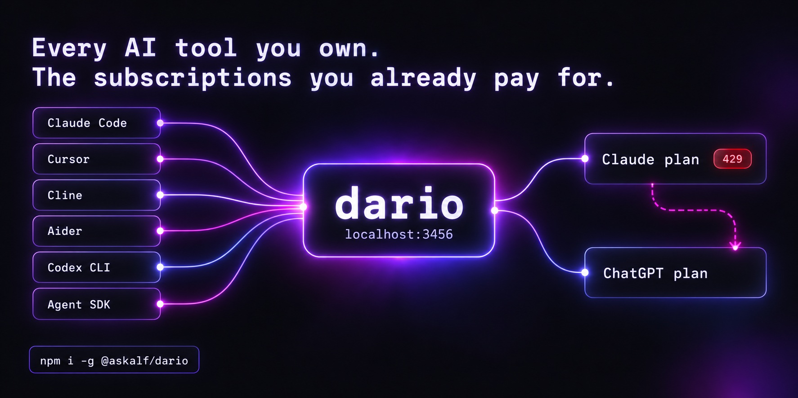
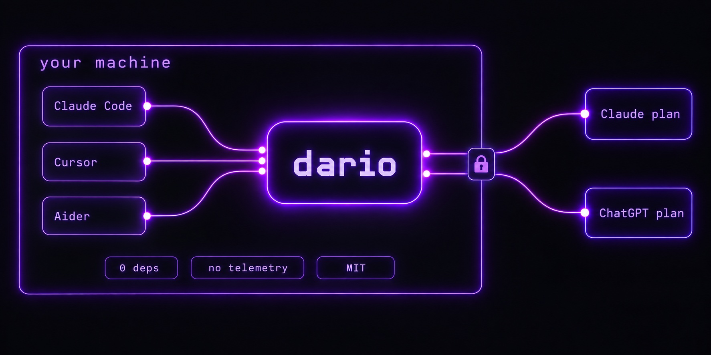

<div align="center">



# `dario`

### Your Claude and ChatGPT subscriptions each work in exactly one place.<br/>dario makes them work **everywhere** — at subscription pricing, not per-token API bills.

<p>
  <a href="https://www.npmjs.com/package/@askalf/dario"></a>
  <a href="https://github.com/askalf/dario/releases"></a>
  <a href="https://github.com/askalf/dario/actions/workflows/ci.yml"></a>
  <a href="https://github.com/askalf/dario/actions/workflows/codeql.yml"></a>
  <a href="https://scorecard.dev/viewer/?uri=github.com/askalf/dario"></a>
  <a href="https://www.bestpractices.dev/projects/13638"></a>
  <a href="https://github.com/askalf/dario/blob/master/LICENSE"></a>
  <a href="https://github.com/askalf/dario/stargazers"></a>
  <a href="https://www.npmjs.com/package/@askalf/dario"></a>
  <a href="https://www.npmjs.com/package/@askalf/dario"></a>
</p>

<p>
  <a href="https://github.com/askalf/dario/blob/master/src/cc-template-data.json"></a>
  <a href="https://github.com/askalf/dario/actions/workflows/cc-billing-classifier-canary.yml"></a>
  <a href="https://github.com/askalf/dario/actions/workflows/cc-drift-watch.yml"></a>
  <a href="https://github.com/askalf/dario/actions/workflows/cc-drift-template-watch.yml"></a>
</p>

<p><strong>One local endpoint. Every AI tool you own. The subscriptions you already pay for.</strong></p>

<sub><code>npm i -g @askalf/dario</code> · <strong>0</strong> runtime deps · <a href="https://www.npmjs.com/package/@askalf/dario">SLSA-attested</a> every release · nothing phones home · ~39k lines you can read in a weekend · independent, unofficial, third-party (<a href="DISCLAIMER.md">DISCLAIMER.md</a>)</sub>

<sub><a href="#start-in-60-seconds">Start</a> · <a href="#why-people-pick-it">Why dario</a> · <a href="#what-it-does-with-a-request">Routing</a> · <a href="#will-my-account-get-suspended">Risk</a> · <a href="#reference">Reference</a> · <a href="#trust--transparency">Trust</a> · <a href="docs/returning.md">Coming back after a while?</a></sub>

</div>

---

You're already paying $20, $100 or $200 a month for Claude,[^plans] or for a ChatGPT plan. Then Cursor wants an API key. Aider wants an API key. Cline, Continue, Zed, your own scripts — every one of them bills you **again**, per token, while the plan you bought sits idle in the one app it shipped with.

**dario is one local endpoint that routes all of them through the plans you already pay for.** Point any Anthropic- or OpenAI-compatible tool at `http://localhost:3456` and you're done. No per-tool config, no second bill, and when one plan hits its limit the other one takes the request.

## Start in 60 seconds

```bash
npm install -g @askalf/dario
dario login      # your Claude plan (Pro, Max 5x or Max 20x); `dario login --manual` for SSH / headless
dario proxy      # leave it running, then point any tool at http://localhost:3456 with key `dario`
```

<picture>
  <source media="(prefers-color-scheme: dark)" srcset=".github/readme/quickstart-dark.svg">
  
</picture>

Anthropic-shaped tools: `export ANTHROPIC_BASE_URL=http://localhost:3456 ANTHROPIC_API_KEY=dario`. OpenAI-shaped tools use `OPENAI_BASE_URL=http://localhost:3456/v1` instead, same key. Every tool that honors those env vars now runs on your subscription.

**Works with:** Claude Code, Cursor, Aider, Cline, Roo Code, Kilo Code, Continue.dev, Zed, OpenHands, OpenClaw, Hermes, Codex CLI, the [Claude Agent SDK](https://www.npmjs.com/package/@anthropic-ai/claude-agent-sdk), the Anthropic and OpenAI SDKs, curl, your own scripts. **[Per-tool setup →](docs/tools.md)**

Prefer Docker? `ghcr.io/askalf/dario:latest` — multi-arch (`amd64` + `arm64`), published from the same workflow as every npm release ([guide](./docs/docker.md)). Something off? `dario doctor` prints one paste-ready health report.

## Why people pick it

- **Every tool, one URL.** No per-tool keys and no second bill: anything with a base-URL setting runs on the plan you already pay for. [Per-tool setup](docs/tools.md)
- **Either plan, either wire shape.** Your ChatGPT plan behind Claude Code and the Anthropic SDKs; Codex CLI on your Claude plan. [Two plans](docs/two-plans.md)
- **Failover that finishes the answer.** A 429 on one plan is re-served by the other, and a stream that dies mid-answer is completed on the same model first. [Failover](docs/two-plans.md#failover-between-subscriptions)
- **Many seats, one endpoint.** Per-model headroom routing, session-sticky prompt cache, in-flight 429 failover across every seat you hold. [The pool](docs/pool-keys-and-analytics.md)
- **One key per developer.** Named keys with a preferred seat, a model allowlist and a daily budget. [Keys](docs/pool-keys-and-analytics.md#one-key-per-developer)
- **Knows what it saved you.** A ledger prices every request at API rates; see it in the TUI, `/analytics`, Prometheus `/metrics` and a per-request timing split. [Analytics](docs/pool-keys-and-analytics.md#what-it-would-have-cost)
- **Tracks Claude Code on its own.** Eleven unattended watchers catch wire-shape drift and ship the fix, usually the same day. [Drift](docs/tracking-claude-code.md)
- **Stops before it costs you.** The overage guard halts the proxy the moment a response bills outside your subscription. [Guardrails](docs/guardrails.md)
- **Your traffic as the benchmark.** Shadow-compare any request against another model and read the results with `dario compare`. [Shadow compare](docs/two-plans.md#shadow-compare)

## What it does with a request

You point every tool at one URL. dario reads each request, decides which plan or backend owns it, and forwards it in that backend's native protocol.

| Client speaks | Model | Routes to | What happens |
|---|---|---|---|
| Anthropic Messages | `claude-*` / `opus` / `sonnet` / `haiku` | Claude pool | OAuth swap + Claude Code template, then `api.anthropic.com` |
| Anthropic Messages | a slug your ChatGPT account lists | Codex engine | Messages→Responses translation, subscription auth |
| Anthropic Messages | `gpt-4o`, `llama-*`, any name no plan lists | Refused | `400` + `x-dario-upstream-rejection: model_unroutable`; reach an API-key backend from this shape with a provider prefix |
| OpenAI Chat | `gpt-*` / `o1-*` / `o3-*` / `o4-*` | OpenAI-compat backend | Auth swap, body forwarded byte-for-byte |
| OpenAI Chat | a slug your ChatGPT account lists | Codex engine | chat/completions→Responses translation, subscription auth |
| OpenAI Chat | `claude-*` | Claude pool | OpenAI→Anthropic translation, then the Claude path |
| Either | `<provider>:<model>` | Forced by prefix | Explicit override |

The tool doesn't know. The backend doesn't know. dario is the seam.

The full Claude lineup, shortcuts, the live model catalog and when a name is refused: [routing.md](docs/routing.md).

## Will my account get suspended?

The most common question about dario, and it deserves a straight answer: **I can't promise you won't be actioned, and I'd be skeptical of anyone who does.** Only Anthropic decides how it enforces its terms. What I can do is lay out exactly how dario works, so you can weigh the risk yourself instead of taking anyone's word for it.

dario runs entirely on your machine, authenticates as you with your own Claude login, sends requests in the shape the official client sends, and reports nothing anywhere. What it adds is letting tools *other than* Claude Code use that subscription, and whether that falls within your plan's terms is Anthropic's call. **[The full answer](docs/account-risk.md)**, including the [billing-split contingency](docs/guardrails.md#the-billing-split-a-contingency-dario-is-built-for).

## Reference

- **[Per-tool setup](docs/tools.md)**: Codex CLI, Claude Code, Cursor, Cline / Roo / Kilo, Aider, Continue, Zed, OpenHands, OpenClaw, the SDKs, curl, Docker
- **[Routing and the model lineup](docs/routing.md)**
- **[Two plans](docs/two-plans.md)**: your ChatGPT plan on both endpoints, failover between subscriptions, shadow compare
- **[Seats, keys and analytics](docs/pool-keys-and-analytics.md)**: the pool, named keys and budgets, the TUI, the ledger, `/metrics`
- **[How dario tracks Claude Code](docs/tracking-claude-code.md)**: the watchers, their live status, and what they caught
- **[Guardrails](docs/guardrails.md)**: the overage guard and the billing split
- **[Will my account get suspended?](docs/account-risk.md)** · **[Who it's for, and how it compares](docs/who-its-for.md)**
- **[Commands, endpoints and more knobs](docs/cli-and-endpoints.md)** · [every flag](docs/commands.md) · [env vars](docs/configuration.md) · [SDK examples](docs/usage.md)
- **[FAQ](docs/faq.md)** · [Docker](docs/docker.md) · [Coming back after a while?](docs/returning.md)

## Trust & transparency



| Signal | Status |
|---|---|
| Source | **~39k** lines of TypeScript across **77** files, auditable in a weekend. One credential path since v5: the pool. |
| Dependencies | **0 runtime.** Verify: `npm ls --production` |
| Provenance | Every release [SLSA-attested](https://www.npmjs.com/package/@askalf/dario) via GitHub Actions + Sigstore, published with OIDC trusted publishing — no long-lived npm token exists to leak |
| Scanning | [CodeQL](https://github.com/askalf/dario/actions/workflows/codeql.yml) on every push and weekly · [ClusterFuzzLite](./.github/workflows/cflite.yml) fuzzes the SSE translator and rejection parsers weekly · [OpenSSF Scorecard](https://scorecard.dev/viewer/?uri=github.com/askalf/dario) and [Best Practices](https://www.bestpractices.dev/projects/13638) badges above are live |
| Tests | **178 test files** run in parallel by `npm test` on Node 18, 20 and 22; the live e2e / compat / stealth suites have their own entry points. Green on every release |
| Credentials | Your own subscription tokens, never logged, redacted from errors, `0600` on disk in `0700` dirs |
| Network | Binds `127.0.0.1` by default; upstream only to configured backends over HTTPS; hardcoded SSRF allow-list; refuses a non-loopback bind without `DARIO_API_KEY` |
| Telemetry | **None.** No analytics, no tracking, nothing phones home |
| Overhead | Measured in the open on every PR: [`scripts/bench-overhead.mjs`](./scripts/bench-overhead.mjs) runs a real proxy against an instant upstream beside a bare http server serving the same bytes. On loopback dario adds no measurable p50 wall time over that floor; the CPU per request is the number to watch, and the per-request [timing split](./docs/analytics.md#the-timing-split) shows it live |
| This README | CI fails if the line count above drifts from `src/` or a link or anchor here stops resolving ([`check-readme-line-count.mjs`](./scripts/check-readme-line-count.mjs), [`check-readme-links.mjs`](./scripts/check-readme-links.mjs)); the TUI screenshots are rendered from the real TUI and the diagrams are briefed art, not screenshots ([how](./scripts/readme/README.md)) |

```bash
npm audit signatures
npm view @askalf/dario dist.integrity
cd $(npm root -g)/@askalf/dario && npm ls --production
```

Security reports go to **security@askalf.org**, not a public issue: [SECURITY.md](SECURITY.md). API stability commitments (`@stable` / `@experimental` / `@deprecated`, deprecation cycles): [STABILITY.md](STABILITY.md).

## Deep dives

- [Claude Code wire drift](https://askalf.github.io/dario/drift-feed/) — every change to what Claude Code sends on the wire, as the template watcher observed it; [RSS](https://askalf.github.io/dario/drift-feed/feed.xml) · [JSON Feed](https://askalf.github.io/dario/drift-feed/feed.json)

- [#183 — Modifying Claude Code's system prompt doesn't change billing; stripping its constraints recovers 1.2–2.8× output](https://github.com/askalf/dario/discussions/183)
- [#68 — dario vs LiteLLM / OpenRouter / Kong AI Gateway (when each wins)](https://github.com/askalf/dario/discussions/68)
- [#14 — Template replay: why we replay the shape instead of matching signals](https://github.com/askalf/dario/discussions/14)
- [#13 — Claude Code's request shape, documented](https://github.com/askalf/dario/discussions/13)
- [#1 — Rate-limit header analysis](https://github.com/askalf/dario/discussions/1)
- [system-prompt-classifier-study.md](./docs/research/system-prompt-classifier-study.md), the measurements behind `--system-prompt=partial`

## Contributing

PRs welcome. Small TypeScript codebase, zero runtime deps. Architecture, file-by-file map and the review bar in [CONTRIBUTING.md](CONTRIBUTING.md); release mechanics in [RELEASING.md](RELEASING.md).

```bash
git clone https://github.com/askalf/dario && cd dario
npm install
npm run dev    # tsx, no build step
npm test       # 178 files in parallel via test/all.test.mjs
npm run e2e    # live proxy + OAuth (needs a working Claude backend)
```

Drift and audit runners, none of them part of `npm test`:

```bash
npm run drift:wire     # compare a live Claude Code capture against the baked template
npm run drift:sdk      # Agent SDK / Stainless pin drift
npm run audit:tui      # drives the real TUI through a fake TTY at 12 geometries
npm run check:overage  # overage-classifier check against live headers
npm run stress         # concurrency / queue behaviour under load
npm run cch:calibrate  # re-derive the billing-tag cch seed for a new Claude Code build
npm run readme:assets  # regenerate the diagrams and TUI screenshots (README + docs/)
```

Two easy ways to help beyond code: **star the repo**, the clearest signal this is useful, and **file drift**: open an issue when a rate-limit header flips or a tool that worked yesterday breaks today, and it gets documented in public alongside the fix. Follow [@ask_alf](https://x.com/ask_alf) for drift bulletins as they land.

<picture>
  <source media="(prefers-color-scheme: dark)" srcset="https://api.star-history.com/svg?repos=askalf/dario&type=Date&theme=dark">
  
</picture>

### Contributors

| Who | Contributions |
|---|---|
| [@GodsBoy](https://github.com/GodsBoy) | Proxy auth, token redaction, error sanitization ([#2](https://github.com/askalf/dario/pull/2)) |
| [@belangertrading](https://github.com/belangertrading) | Billing-classification investigation ([#4](https://github.com/askalf/dario/issues/4), [#6](https://github.com/askalf/dario/issues/6), [#7](https://github.com/askalf/dario/issues/7), [#12](https://github.com/askalf/dario/issues/12), [#23](https://github.com/askalf/dario/issues/23)), multi-agent billing FAQ ([#27](https://github.com/askalf/dario/pull/27)) |
| [@wysie](https://github.com/wysie) | ESM `require` crash in `dario login` ([#15](https://github.com/askalf/dario/issues/15)), OAuth for Max-plan accounts ([#18](https://github.com/askalf/dario/issues/18)) |
| [@earlvanze](https://github.com/earlvanze) | OpenClaw tool mappings ([#19](https://github.com/askalf/dario/pull/19)), OAuth manual override ([#47](https://github.com/askalf/dario/pull/47)), HTTPS warning ([#53](https://github.com/askalf/dario/pull/53)) |
| [@nathan-widjaja](https://github.com/nathan-widjaja) | README positioning structure — the promise → who → first use → why-switch spine the page still runs on ([#21](https://github.com/askalf/dario/issues/21)) |
| [@trinhnvgem](https://github.com/trinhnvgem) | OAuth login failures on first release ([#22](https://github.com/askalf/dario/issues/22)), container and headless callback binding ([#28](https://github.com/askalf/dario/issues/28)) |
| [@adubkov](https://github.com/adubkov) | The container / headless-SSH case behind the manual OAuth code paste ([#28](https://github.com/askalf/dario/issues/28)) |
| [@iNicholasBE](https://github.com/iNicholasBE) | macOS keychain credential detection ([#30](https://github.com/askalf/dario/pull/30)) |
| [@boeingchoco](https://github.com/boeingchoco) | Reverse tool-param translation ([#29](https://github.com/askalf/dario/issues/29)), SSE framing regression catch, hybrid-tool motivation ([#33](https://github.com/askalf/dario/issues/33), [#36](https://github.com/askalf/dario/issues/36)) |
| [@tetsuco](https://github.com/tetsuco) | Scrubber path corruption ([#35](https://github.com/askalf/dario/issues/35)), OpenClaw reverse-mapping collisions ([#37](https://github.com/askalf/dario/issues/37)), 20x-tier report ([#42](https://github.com/askalf/dario/issues/42)) |
| [@mikelovatt](https://github.com/mikelovatt) | Silent subscription-drain surfaced via friendly billing buckets ([#34](https://github.com/askalf/dario/issues/34)) |
| [@ringge](https://github.com/ringge) | `--no-auto-detect` for text-tool auto-preserve ([#40](https://github.com/askalf/dario/issues/40)) |
| [@rustanacexd](https://github.com/rustanacexd) | Cursor BYOK routing for Claude, and `--effort=max` ([#190](https://github.com/askalf/dario/issues/190)) |
| [@daimonbot](https://github.com/daimonbot) | Official multi-arch Docker image on GHCR ([#199](https://github.com/askalf/dario/issues/199)) |
| [@Saik0s](https://github.com/Saik0s) | Wildcard CORS allow-headers, Opus 4.7 catalog entry ([#222](https://github.com/askalf/dario/pull/222)) |
| [@lwsh123k](https://github.com/lwsh123k) | `cch` anchored to the billing tag instead of first match ([#528](https://github.com/askalf/dario/issues/528)) |
| [@boredland](https://github.com/boredland) | Time-to-reset in `dario doctor --usage` ([#550](https://github.com/askalf/dario/pull/550)) |
| [@pnewell](https://github.com/pnewell) | `--preserve-output-format` for structured-output SDKs ([#583](https://github.com/askalf/dario/pull/583)) |
| [@matteo-rama](https://github.com/matteo-rama) | Headless admin bootstrap ([#599](https://github.com/askalf/dario/issues/599)), Analytics `NaN` and per-account rate-limit rows ([#600](https://github.com/askalf/dario/issues/600)), pool-aware `/status` and `/health` ([#636](https://github.com/askalf/dario/issues/636)), `version` on both ([#640](https://github.com/askalf/dario/issues/640)), Accounts TUI reads the live pool ([#641](https://github.com/askalf/dario/issues/641)) |
| [@miklisanton](https://github.com/miklisanton) | Mid-session `/model` switch 400 ([#744](https://github.com/askalf/dario/issues/744)), empty-turn guards behind the subagent 400s ([#1033](https://github.com/askalf/dario/issues/1033), [#1117](https://github.com/askalf/dario/issues/1117)) |
| [@p-i-](https://github.com/p-i-) | Independent wire-fidelity audit with a re-runnable harness — version-blind `bun-match`, and the correction to the packet-identical claim ([#813](https://github.com/askalf/dario/issues/813)) |
| [@jerzydziewierz](https://github.com/jerzydziewierz) | TUI Config tab clipping and scrolling ([#861](https://github.com/askalf/dario/pull/861)) |
| [@ramarro123](https://github.com/ramarro123) | Admin bulk re-auth ([#913](https://github.com/askalf/dario/issues/913)), shared state across instances ([#993](https://github.com/askalf/dario/issues/993)), prompt-cache behaviour under litellm ([#1018](https://github.com/askalf/dario/issues/1018)), parked-seat and shared-window reporting ([#1244](https://github.com/askalf/dario/issues/1244)) |
| [@zytegalaxy](https://github.com/zytegalaxy) | The ChatGPT/Codex engine and `dario add altman` ([#1009](https://github.com/askalf/dario/issues/1009)) |
| [@chaogebaba](https://github.com/chaogebaba) | Auto-release must never fire from a fork ([#1029](https://github.com/askalf/dario/pull/1029)) |
| [@robincle](https://github.com/robincle) | Utilisation freshness — `lastObservedAt` / `utilAgeMs` on `/accounts` ([#1032](https://github.com/askalf/dario/issues/1032)) |
| [@anupamme](https://github.com/anupamme) | Refresh-lock ownership by server-issued lock id ([#1059](https://github.com/askalf/dario/pull/1059)) |
| [@LiveNathan](https://github.com/LiveNathan) | Never send or stamp empty text blocks ([#1067](https://github.com/askalf/dario/pull/1067)), empty final user turn from CC's stream-interruption retry ([#1092](https://github.com/askalf/dario/issues/1092), as [@NathanLively](https://github.com/NathanLively)) |

### Sponsors

<!-- sponsors:start -->
dario is funded by its users through [GitHub Sponsors](https://github.com/sponsors/askalf) — the live-test seats it is checked against before every release are the biggest line item. Sponsors at $25/month and up are listed here.
<!-- sponsors:end -->

<sub>This block and the thank-you in each release's notes come from <a href="scripts/sponsors.mjs"><code>scripts/sponsors.mjs</code></a>, which reads the public sponsor list; <code>sponsors-readme.yml</code> opens a PR when it changes. Private sponsors are never named.</sub>

## Disclaimers

**dario is an independent, unofficial, third-party project.** Not affiliated with, endorsed by, or sponsored by Anthropic, OpenAI, or any vendor referenced here. Provided as-is, no warranty. You are solely responsible for compliance with your subscription's terms, the security of your credentials, and the content you send through the proxy. Not for safety-critical, regulated, or production environments without your own review. Full text: [DISCLAIMER.md](DISCLAIMER.md).

## License

MIT — see [LICENSE](LICENSE) and [DISCLAIMER.md](DISCLAIMER.md). The embedded README font is Space Mono under the [SIL Open Font License](./scripts/readme/fonts/OFL.txt).

## Own Your Stack

dario is the routing layer of **[Own Your Stack](https://github.com/askalf)**, open tools for owning your AI infrastructure instead of renting it by the token. One subscription. Your box. Your terms.

- **[dario](https://github.com/askalf/dario)** — own your routing _(you are here)_
- **[browser-bridge](https://github.com/askalf/browser-bridge)** — own your browser
- **[redstamp](https://github.com/askalf/redstamp)** — own your agent security
- **[truecopy](https://github.com/askalf/truecopy)** — own your agent skills
- **[agent-security-stack](https://github.com/askalf/agent-security-stack)** — own your agent security stack: redstamp + truecopy + strongroom leases, one MCP server
- **[cordon](https://github.com/askalf/cordon)** — own your prompts · [pair it with dario](./docs/integrations/cordon.md)
- **[plumbline](https://github.com/askalf/plumbline)** — own your agent oversight
- **[amnesia](https://github.com/askalf/amnesia)** — own your search
- **[pgflex](https://github.com/askalf/pgflex)** — own your Postgres
- **[redisflex](https://github.com/askalf/redisflex)** — own your Redis
- **[askalf](https://askalf.org)** — own your operation: the AI operation that runs Sprayberry Labs

## Built by Thomas Sprayberry

dario is part of **Own Your Stack**, the open toolkit behind **[Sprayberry Labs](https://sprayberrylabs.com)**, the software studio with one human on staff, run by [askalf](https://askalf.org), the AI operation these tools are part of.

Built in the open, scars included. Follow the build: **[@ask_alf](https://x.com/ask_alf)** · **[sprayberrylabs.com/own-your-stack](https://sprayberrylabs.com/own-your-stack)**

[^plans]: Pro at $20 a month, Max 5x at $100, Max 20x at $200, as listed on [claude.com/pricing](https://claude.com/pricing) on 2026-09-06. Annual billing is cheaper; check the page for what's current.
