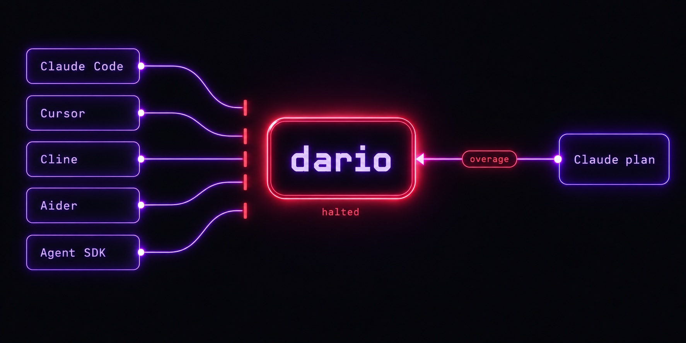

# Guardrails

## Overage guard

During normal operation, a subscriber should never see a single response billed outside their subscription pool. If one is, something is wrong — wire-shape drift, an account misconfig, a change upstream — and forwarding more requests in the same shape either bleeds real money (accounts with extra usage enabled) or returns a wall of rejections. The first hit is the signal; the rest are damage.

So the moment any upstream response bills to something other than your subscription pool, dario **halts the proxy**. The check is an allow-list, not a match on one string: anything that isn't a known subscription claim (`five_hour` / `seven_day`, their `_fallback` and `_overage_included` variants, and the `chatgpt_subscription` claim dario stamps on Codex-served responses) and isn't the `unknown` no-header sentinel trips it, so a billing bucket dario has never seen still halts. Subsequent requests return `503` with an Anthropic-shaped error body until you run `dario resume`, press <kbd>R</kbd> in the TUI, or the cooldown clears (default 30 min). The halt shows across the TUI, fires a best-effort OS notification, and emits named SSE events. Tune it via `~/.dario/config.json` → `overageGuard`, or `--overage-behavior=warn` / `--no-overage-guard` / `--overage-cooldown=<ms>`. In upstream-API-key passthrough mode (`ANTHROPIC_UPSTREAM_API_KEY`) the guard is off; `api` billing is the point there. Verified end-to-end by [`test/overage-guard-e2e-live.mjs`](../test/overage-guard-e2e-live.mjs). Background: [#288](https://github.com/askalf/dario/issues/288).

## The billing split, a contingency dario is built for

On **2026-05-13** Anthropic [announced](https://support.claude.com/en/articles/15036540-use-the-claude-agent-sdk-with-your-claude-plan) that, from 2026-06-15, Agent SDK and `claude -p` (headless) traffic would leave the subscription pool for a small separate monthly credit, then metered API rates. **They paused it before that date.** Those surfaces still bill subscription today, and Anthropic says it will give advance notice before any revised version. Nothing changed; no credits were issued.

The split isn't live, but it was announced once on short notice and could return, so dario is built for it either way. Every request is rebuilt into interactive Claude Code shape before it leaves your machine (and, with `--stealth`, the response-correlated timing an interactive session has), so your traffic sits in the subscription pool whether a split is paused or live. The daily canary above is the tripwire: it surfaces a revived split within a day instead of on a surprise invoice. Verify on your own machine right now: `dario doctor --usage` fires one request and prints the rate-limit headers; `representative-claim` should read `five_hour` or `seven_day`, both subscription buckets. Full timeline: [why-now-2026-06.md](why-now-2026-06.md).

---

[← README](../README.md) · [all reference docs](../README.md#reference)
