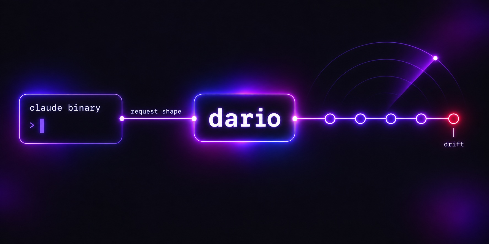

# It tracks a moving target

Claude Code's request shape changes between releases — new betas, tool renames, per-model thinking configs — usually with no subscriber-facing note. dario doesn't *guess* that shape: it captures it live from your own installed `claude` binary on every startup, diffs it against each upstream release, and replays it faithfully. That's why your subscription routes the same through dario as it does through Claude Code itself: the request that leaves your machine *is* the shape your plan expects. Details: [wire-fidelity.md](wire-fidelity.md) · [#13](https://github.com/askalf/dario/discussions/13) · [#14](https://github.com/askalf/dario/discussions/14).

Keeping that current is the whole job, and it's automated. These watchers run unattended; each badge is the live status of that workflow's latest run, and its label is the cadence:

| Watcher | Catches | Live |
|---|---|---|
| [`cc-drift-watch`](../.github/workflows/cc-drift-watch.yml) | A new Claude Code npm release that changes the wire shape. Auto-drafts the fix; [`cc-drift-auto-release`](../.github/workflows/cc-drift-auto-release.yml) merges and ships it within minutes. |  |
| [`cc-drift-template-watch`](../.github/workflows/cc-drift-template-watch.yml) | Same-binary *remote-config* drift, which no npm diff can see. Runs against a live Claude session on a self-hosted runner and opens a rebake PR with the diff inline. |  |
| [`cc-billing-classifier-canary`](../.github/workflows/cc-billing-classifier-canary.yml) | Classifier drift: one real request a day must still bill to a subscription bucket. |  |
| [`wire-drift-self-hosted`](../.github/workflows/wire-drift-self-hosted.yml) | Per-model beta headers and billing blocks the installed `claude` actually sends, model by model. |  |
| [`sdk-drift-watch`](../.github/workflows/sdk-drift-watch.yml) | Agent SDK / Stainless pins drifting from what the template assumes. |  |
| [`pricing-drift-watch`](../.github/workflows/pricing-drift-watch.yml) | dario's pricing table drifting from Anthropic's published rates, so the TUI's cost figures stay honest. |  |
| [`codex-drift-watch`](../.github/workflows/codex-drift-watch.yml) | The ChatGPT backend's model list or wire contract moving under the translator. |  |
| [`cc-oauth-health`](../.github/workflows/cc-oauth-health.yml) | The maintainer's own production proxy going unhealthy on any axis. |  |
| [`dario-doctor-watch`](../.github/workflows/dario-doctor-watch.yml) | Runtime drift only a live `dario doctor --obedience` surfaces: identity, obedience, usage buckets. |  |
| [`deployed-version-watch`](../.github/workflows/deployed-version-watch.yml) | Publishing is not deploying: is what's running what was last released? |  |
| [`cc-drift-watcher-liveness`](../.github/workflows/cc-drift-watcher-liveness.yml) | The watcher itself going quiet. Lives on GitHub-hosted infrastructure on purpose, so it survives the failures it watches for. |  |

Guarded at PR time by [`live-test`](../.github/workflows/live-test.yml), a required check that runs the full suite against a live proxy on a self-hosted runner, plus [`compat-test-self-hosted`](../.github/workflows/compat-test-self-hosted.yml), which replays the compat suite through a passthrough proxy on wire-shape changes. A few changes the watchers caught and shipped fixes for, same day:

| Change (no subscriber-facing note) | Effect | dario shipped |
|---|---|---|
| `context-1m` dropped from the default beta set on the OAuth path | Subscription requests default to the 200K window on Sonnet/Opus | v3.38.3–4 |
| `thinking: {type:"adaptive"}` gated per-model server-side | Sonnet/Opus 4-5 400 every request through any proxy | [v3.38.5](https://github.com/askalf/dario/pull/273) |
| Per-model `anthropic-beta` sets | Proxies sending one set diverge for non-Opus models | [v4.8.53](https://github.com/askalf/dario/pull/478) |

The full ledger lives in the [CHANGELOG](../CHANGELOG.md), 500+ releases since April 2026. Setup and walkthrough: [drift-monitor.md](drift-monitor.md). The residual manual cases — OAuth rotation, runner re-registration — are in the [recovery runbook](recovery.md).

---

[← README](../README.md) · [all reference docs](../README.md#reference)
