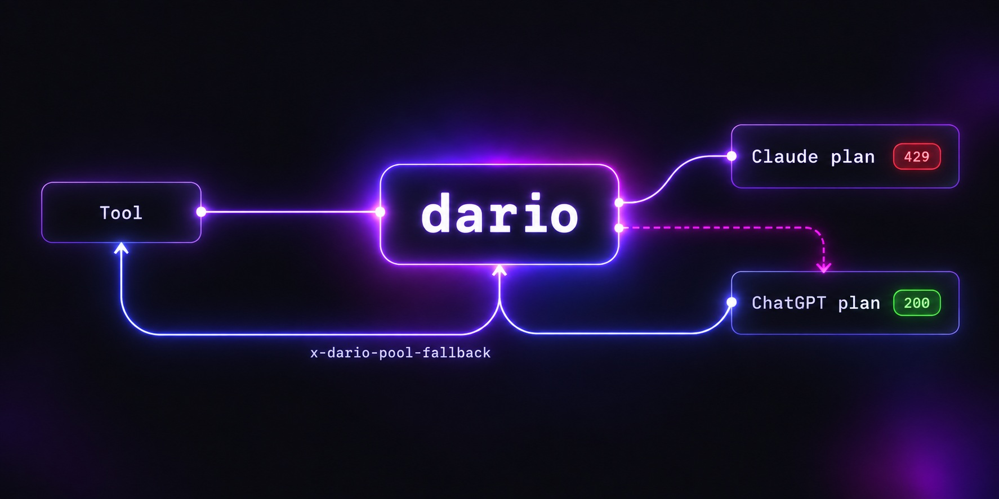

# Two plans, one endpoint

## Your ChatGPT plan, on both endpoints

A ChatGPT Plus or Pro plan is served on **all three** of dario's endpoints: any client that speaks `/v1/chat/completions` or `/v1/responses` can use it (Codex CLI, the OpenAI SDKs, the Agents SDK, your scripts), and so can any client that speaks `/v1/messages` (Claude Code, the Anthropic SDKs, agent runtimes). The harness never needs to know which subscription is behind it — and the symmetry holds: Codex CLI runs on a Claude plan the same way.

An Anthropic-shape client that declares Anthropic's hosted `web_search_20260209` tool gets **real web search on the ChatGPT plan** (since 6.4): the plan's own search runs, and the client sees Anthropic's own blocks — `server_tool_use` with the query, `web_search_tool_result` listing the pages searched, the answer with `web_search_result_location` citations. `allowed_domains` and `user_location` carry over, and so does forcing the search with `tool_choice`; `blocked_domains` and `max_uses` do not.

```bash
dario add altman            # prints an authorize URL; paste the redirect URL back
dario codex list
dario codex remove altman
```

`dario add altman` names whose plan you are attaching; `dario add amodei` attaches a Claude account instead. The browser lands on a `localhost` page that doesn't load — expected, nothing is listening there. Copy the whole address bar and paste it at the prompt; dario reads the code out of it.

```bash
curl localhost:3456/v1/models | jq -r '.data[].id'
curl localhost:3456/v1/chat/completions -H 'content-type: application/json' \
  -d '{"model":"gpt-5.5","messages":[{"role":"user","content":"hi"}]}'

# same subscription, Anthropic wire shape — this is what Claude Code speaks
curl localhost:3456/v1/messages -H 'content-type: application/json' \
  -d '{"model":"gpt-5.5","max_tokens":64,"messages":[{"role":"user","content":"hi"}]}'
```

**Model names are discovered, not hardcoded.** The set a ChatGPT subscription may use is per-account and moves; dario asks the backend which models this account lists, caches the answer, and advertises them on `GET /v1/models`. Anything not on that list (`gpt-4o` and friends) still routes to a configured API-key backend as before. `codex:<model>` / `chatgpt:<model>` forces the route.

Streaming, tool calls and tool-result round trips work on both shapes, and chat-shape `image_url` parts are carried as Responses `input_image` parts with `detail` preserved: dario translates chat/completions **or** Messages into the Responses API the subscription backend speaks, and translates the stream back into `chat.completion.chunk` or Anthropic message events. There is no `/v1/responses` inbound yet. The Codex backend does not accept every chat field, so `response_format`, `stop`, `n`, `logprobs`, `stream_options` and the sampling parameters `temperature`, `top_p`, `max_tokens`, `max_completion_tokens` are intentionally lossy; with `--verbose`, dario reports each field that does not reach Codex once per process. Codex accounts live in `~/.dario/codex-accounts/`, separate from the Claude pool.

**Prompt caching:** the backend caches prompt prefixes of 1,024 tokens and up on its own; what dario adds is the `prompt_cache_key` that routes same-prefix requests to the cache that holds them, the way the Codex CLI does with its session id. A chat/completions client that sets its own key keeps it; an Anthropic-shape request gets one per Claude Code session (a hash of `metadata.user_id`, never the raw ids); anything else is keyed on its model, instructions and tool names, so repeated system prompts from any caller land together. Cached tokens come back as `prompt_tokens_details.cached_tokens` on chat/completions and as `cache_read_input_tokens` on `/v1/messages`, and show up in `/analytics` and the `-v` usage line like a Claude request's do.

## Failover between subscriptions

Two consumer plans, no API keys, and neither one able to take you down on its own.

```bash
dario proxy --pool-fallback=gpt-5.6-sol,claude-sonnet-5
```

That is a **chain**, read left to right; each provider takes the first entry it can actually serve. Prefix every entry with a tier and the same flag becomes a **tier map**: `--pool-fallback=haiku:gpt-5.6-luna,sonnet:gpt-5.6-terra,opus:gpt-5.6-sol` picks one rung per request from the tier of the model asked for (`default:` catches the rest, otherwise the first rung), so heartbeat work on Haiku never overflows onto a flagship. That shipped in 6.0.17, the same day a Haiku-tier fleet spent 79% of a weekly allowance doing exactly that. When the Claude pool is drained or cooling, the request is served as `gpt-5.6-sol` from your ChatGPT subscription. When the subscription is rate-limited or down, the request is handed back to the Claude pool as `claude-sonnet-5`. Every substituted response carries `x-dario-pool-fallback: <model>` — a silently swapped model family is exactly the surprise this project exists to avoid.



A single-entry chain is one-way and means what it always meant, so an existing config is unaffected. Failover is opt-in: without `--pool-fallback`, a drained pool still returns its honest 429/503. Only a **429 or 5xx** fails over; a 400 surfaces, because a bad request that fails over just reproduces itself on the other provider and buries the real cause. A 429 also cools that provider for a bounded interval, its `retry-after` if it sent one and 60 s otherwise, never longer than 15 min, and an entry that already declined is not asked again within the same request. When every entry is cooling, the request ends on one honest `429` with a `retry-after` instead of a retry storm. The Claude entry has to be a model the pool can actually serve, checked positively against the live catalog, so a typo can't trade a recoverable 429 for an unrecoverable 404.

The chain also covers a stream that dies **mid-answer**. Until 6.1 that was the one failure nothing could catch: bytes were on the wire, so the socket reset, the in-band `overloaded_error`, the codex `response.failed` all ended the stream where they happened, with no `message_stop`, and the client threw away every word it already had. Now dario finishes the same stream — on the same model first, a fresh request through its own front door; on the other subscription when that delivers nothing or dies too. The resume picks up inside the still-open content block, a comment marks each seam (`: dario continuation claude-opus-5 (same model) after 1240 chars`), and the client sees one message. The model is asked to repeat the last few words verbatim and dario trims the repeat, so the join is rendered by a model and cut by a parser, never guessed. Text only — a cut inside a tool call ends as it always did. On by default, `--no-midstream-continue` turns it off; without a chain the second hop is simply not there. [How it works](midstream-continuation.md).

`dario doctor` tells you which of these you are actually in:

```
[ OK ]  Failover   symmetric: gpt-5.6-sol → claude-sonnet-5, across 1 Codex account
[WARN]  Failover   armed (gpt-5.6-sol) but INERT — no Codex account and no backend
                   to fall back to. Add one: `dario add altman`
```

That warning is the whole reason the check exists. Armed with nothing to fall back to is green on every other check and incapable of doing anything.

> [!NOTE]
> Upgrading from v5? Nothing to do. Every v6 feature is opt-in and a single-value `--pool-fallback` behaves exactly as it did. [CHANGELOG](../CHANGELOG.md#600---2026-08-30)

## Shadow compare

Once either subscription can serve either wire shape, the interesting question stops being *can I reach GPT* and becomes *which of these is better at my work*. Benchmarks answer that badly. Your own traffic answers it well.

```bash
curl localhost:3456/v1/messages \
  -H 'content-type: application/json' \
  -H 'x-dario-compare: gpt-5.6-sol' \
  -d '{"model":"claude-opus-5","max_tokens":1024,"messages":[…]}'
```

You get the Claude answer, exactly as you would have. Beside it, dario runs the same prompt past `gpt-5.6-sol` and writes both to `~/.dario/compare/<timestamp>-<model>.json`, in your own wire shape, so you are comparing like with like. The comparison cannot degrade the request it observes: it only reads bytes already on their way out, your request is never held open for it, and a comparison that fails, times out or has nowhere to go is dropped with the record still written. Both sides are stored as raw payloads, because extracting text is where a bug would quietly make two answers look more alike than they are.

Read them with **`dario compare`**: calls, success rate, median latency, how often each model's answer parsed as JSON, average length — and, above all, why any comparison was skipped. That last column is the point. The records had no reader until 6.7, and a week-long comparison on a box collected 919 of them without a single usable result, every one carrying its own reason inside the file. A log nobody can read is a log nobody reads.

```
  Records: 1,515  (2026-09-06 → 2026-09-13)
  Compared: 1,515 with both sides

  model          calls    200s    median   valid JSON   avg chars
  gpt-5.6-luna    1515    100%    2736ms          98%          410
  gpt-5.5         1515     99%    2729ms         100%          523
```

---

[← README](../README.md) · [all reference docs](../README.md#reference)
